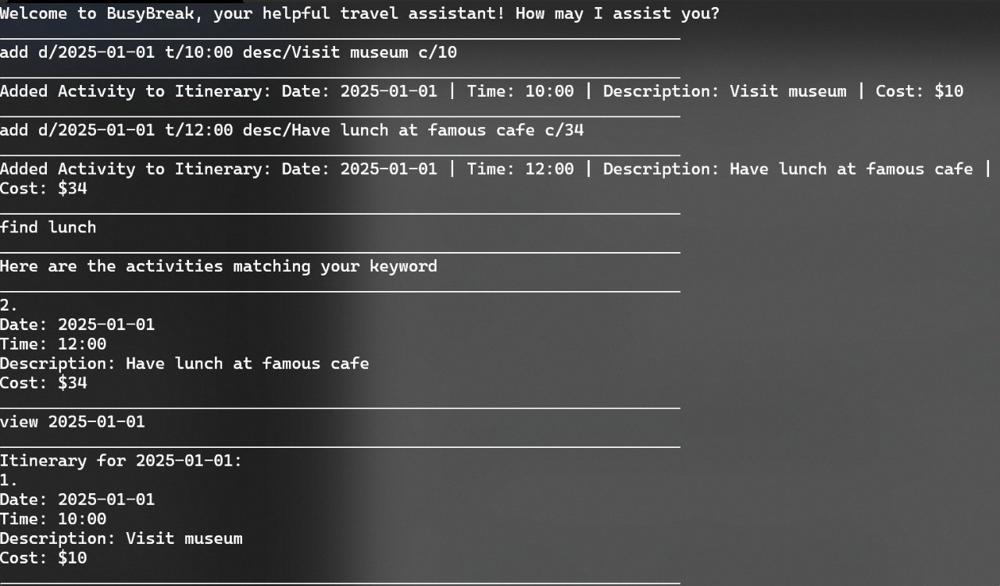
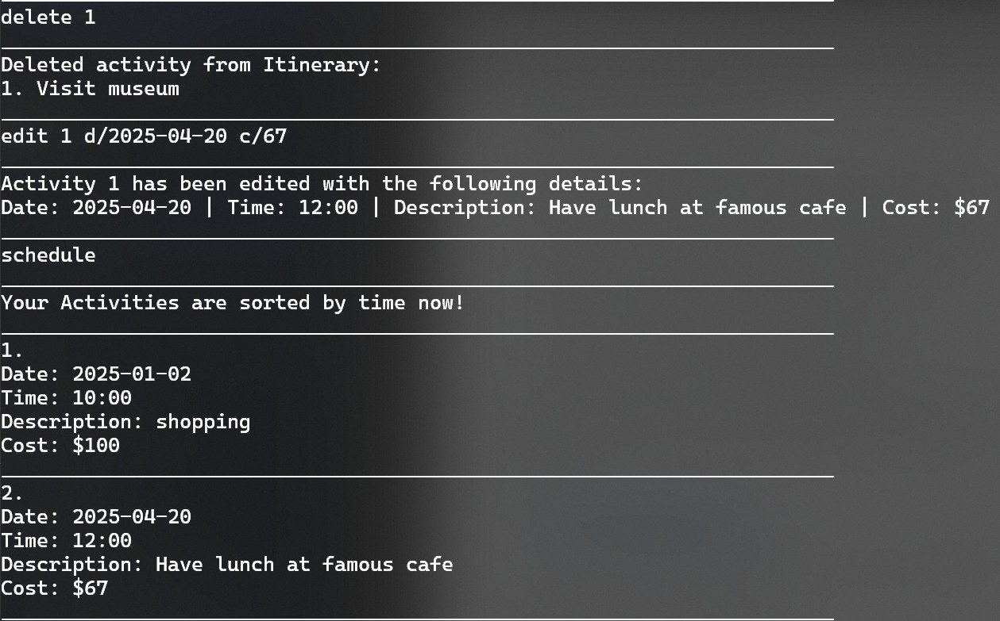

# JTKY Webpage

Personal portfolio site.

## Files

- `index.html` — markup
- `styles.css` — styles
- `main.js` — nav, gallery, scroll reveal, back-to-top
- `finisher-header.es5.min.js` — animated banner library
- `assets/` — project and hobby images

## Adding a project or hobby

1. Add your images into a new folder under `assets/`, e.g. `assets/project-4/`.
2. In `index.html`, copy an existing `<article class="project">` block inside the relevant `<div class="projects__grid">` (Projects or Hobbies) and paste it where you want the new card.
3. Update the new block:
   - Inside `.gallery__track`, list as many `` as required.
   - Update the project tag, title , description, and tags.

Example:

```html
<article class="project">
  <div class="project__gallery">
    <div class="gallery__track">
      
      
    </div>
  </div>
  <span class="project__tag">Project 4</span>
  <h3>Title</h3>
  <p>Short description.</p>
  <div class="project__stack">
    <span class="chip">Tag</span>
    <span class="chip">Tag</span>
  </div>
</article>
```
